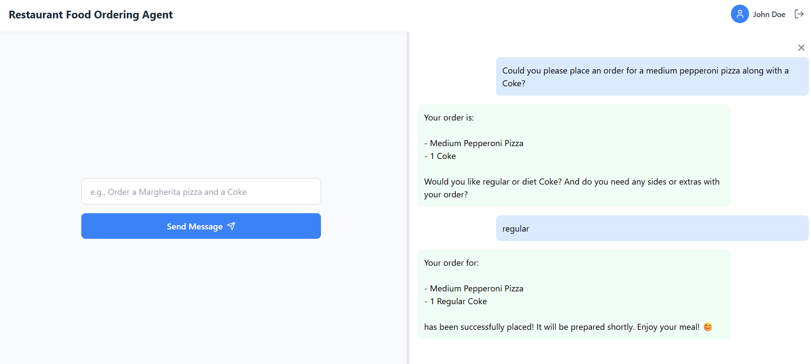

# Food Ordering Agent

This project demonstrates a multi-agent system using Semantic Kernel and A2A for a restaurant food ordering scenario. The system consists of a backend agent server and a customer-facing client, both communicating via HTTP APIs.

## Features

- Order food from a restaurant menu using natural language
- Multi-turn conversation support
- Modular agent design using Semantic Kernel and A2A
- Easily extensible for more restaurant or menu features

## Components

- **AgentServer**: Hosts the `SemanticKernelFoodOrderingAgent` and exposes an A2A-compatible API for food ordering.
- **CustomerAgent**: FastAPI app with a `/chat` endpoint and a sample UI for customers to place food orders.

## Setup

### 1. Clone the repository and install dependencies

```sh
pip install -r requirements.txt
```

### 2. Configure Azure OpenAI credentials

Create a `.env` file in both `AgentServer` and `CustomerAgent` folders with the following content:

```
AZURE_OPENAI_API_KEY=your-azure-openai-api-key
AZURE_OPENAI_ENDPOINT=https://your-azure-endpoint.openai.azure.com
AZURE_OPENAI_DEPLOYMENT=your-deployment-name
AZURE_OPENAI_API_VERSION=2025-01-01-preview
```

### 3. Run the Food Ordering Agent Server

```sh
cd AgentServer
python -m __main__
```

The agent server will start on port 9999.

### 4. Run the Customer Agent (UI/API)

```sh
cd CustomerAgent
python customer-agent.py
```

The customer API/UI will start on port 8000.

## Usage

- Open your browser to `http://localhost:8000` to use the sample food ordering UI.
- Or, POST to `http://localhost:8000/chat` with `user_input` to interact programmatically.

## Custom UI Implementation

You can create a custom user interface using your preferred frontend framework. Here's an example of a modern React.js implementation of the food ordering system:



Watch the demo video: <a href="https://www.youtube.com/watch?v=6xsuRXlzxUI" target="_blank">Food Ordering System Demo</a>

The React.js implementationprovides a more sophisticated user interface while still communicating with the same `/chat` endpoint on port 8000. Key features of this UI include:

- Modern, responsive design
- Interactive menu selection
- Real-time order updates
- Enhanced user experience

To implement your own React.js frontend:

1. Create a new React application
2. Configure the API endpoint to communicate with the Customer Agent
3. Design your UI components
4. Handle the chat interactions with the backend

## Example Food Orders

- "Order a Margherita pizza and a Coke."
- "I would like two cheeseburgers and fries."
- "Can I get a vegan salad and sparkling water?"

## Customization

- To add more menu items or logic, update the agent code in `AgentServer/agent.py`.
- To build a custom UI, connect your frontend to the `/chat` endpoint on port 8000.

## Notes

- CORS is enabled for development. Restrict origins in production.
- All secrets are loaded from `.env` files using `python-dotenv`.

## License

This project is licensed under the MIT License. See the `LICENSE` file for details.

## Contributing

Contributions are welcome! Feel free to open issues or submit pull requests to improve the food ordering agent or add new features.

---

Built with [Semantic Kernel](https://github.com/microsoft/semantic-kernel) and [A2A](https://github.com/google-a2a/a2a-samples).
